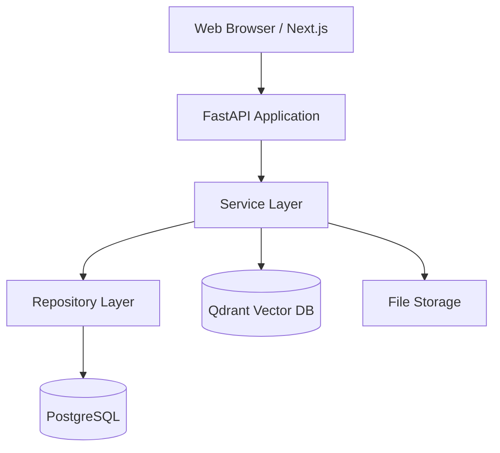
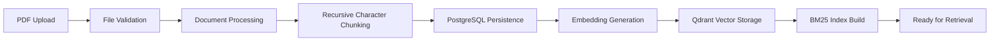
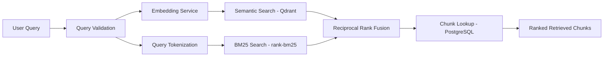

<div align="center">

# ResearchMind AI

**Enterprise-grade Retrieval-Augmented Generation (RAG) platform for scientific literature.**

[](https://python.org)
[](https://fastapi.tiangolo.com)
[](https://nextjs.org)
[](https://postgresql.org)
[](https://qdrant.tech)
[](https://docker.com)
[](LICENSE)

</div>

---

## Overview

ResearchMind AI solves a fundamental problem: scientific literature is vast, and traditional keyword search (PubMed, Google Scholar, arXiv) is imprecise. Important papers are missed because they use different terminology than the query.

The platform ingests PDFs, extracts structured content, generates embeddings, and enables **hybrid retrieval** that finds relevant passages even when the query uses different words than the source text.

### How it Works

```
Upload PDF → Process Text → Chunk → Embed → Store → Hybrid Search → Results
```

---

## Architecture

### System Diagram



### Indexing Pipeline



### Retrieval Pipeline



---

## Features

| Category | Feature | Status |
|----------|---------|--------|
| **Ingestion** | PDF upload & validation | ✅ |
| **Ingestion** | Metadata extraction | ✅ |
| **Ingestion** | Recursive character chunking | ✅ |
| **Ingestion** | Multiple embedding providers | ✅ |
| **Storage** | PostgreSQL chunk persistence | ✅ |
| **Storage** | Qdrant vector storage | ✅ |
| **Retrieval** | Semantic (vector) search | ✅ |
| **Retrieval** | BM25 keyword search | ✅ |
| **Retrieval** | Hybrid search with RRF | ✅ |
| **Auth** | JWT authentication with refresh tokens | ✅ |
| **UI** | Dashboard, Library, Search, Viewer | ✅ |
| **UI** | Dark mode, responsive design | ✅ |
| **Infra** | Docker deployment with health checks | ✅ |
| **Testing** | 236 backend tests (unit + integration) | ✅ |
| **Future** | AI answer generation | 🔜 |
| **Future** | Cross-encoder reranking | 🔜 |
| **Future** | Literature review generation | 🔜 |

---

## Quick Start

### Prerequisites

- Python 3.13+
- Node.js 22+
- Docker Desktop
- [uv](https://docs.astral.sh/uv/) (recommended) or pip
- npm or yarn

### 1. Clone & Setup

```bash
git clone https://github.com/your-org/researchmind-ai.git
cd researchmind-ai
```

### 2. Configure Environment

```bash
cp .env.example .env
# Edit .env with your GEMINI_API_KEY and SECRET_KEY
```

### 3. Start Infrastructure

```bash
docker compose up -d
# Starts PostgreSQL (port 5432) and Qdrant (port 6333)
```

### 4. Start Backend

```bash
cd backend
uv sync
uv run alembic upgrade head
uv run uvicorn app.main:app --reload --host 0.0.0.0 --port 8000
```

### 5. Start Frontend

```bash
cd frontend
npm install
npm run dev
# Opens at http://localhost:3000
```

---

## Docker Deployment

### Production Build

```bash
# Deploy all services
docker compose -f docker-compose.prod.yml up -d --build

# Monitor logs
docker compose -f docker-compose.prod.yml logs -f

# Stop
docker compose -f docker-compose.prod.yml down
```

### Service Overview

| Service | Container Name | Port | Description |
|---------|---------------|------|-------------|
| PostgreSQL | `researchmind-postgres` | 5432 | Relational database |
| Qdrant | `researchmind-qdrant` | 6333 | Vector database |
| Backend | `researchmind-backend` | 8000 | FastAPI application |
| Frontend | `researchmind-frontend` | 3000 | Next.js application |

### Health Checks

All services include Docker health checks. The backend and frontend wait for their dependencies to be healthy before starting.

```bash
# Check service status
docker compose -f docker-compose.prod.yml ps

# Check backend health
curl http://localhost:8000/health
```

---

## Project Structure

```
researchmind-ai/
├── backend/                          # FastAPI application
│   ├── app/
│   │   ├── api/                      # HTTP routes
│   │   ├── chunking/                 # Document chunking
│   │   ├── core/                     # Config, exceptions
│   │   ├── database/                 # SQLAlchemy setup
│   │   ├── dependencies/             # FastAPI DI
│   │   ├── embeddings/               # Embedding providers
│   │   ├── hybrid/                   # Hybrid retrieval
│   │   ├── models/                   # SQLAlchemy ORM
│   │   ├── processing/               # PDF processing
│   │   ├── repositories/            # Data access layer
│   │   ├── retrieval/                # Semantic retrieval
│   │   ├── services/                 # Business logic
│   │   ├── storage/                  # File system
│   │   └── vectorstore/              # Qdrant integration
│   ├── tests/                        # Test suite
│   ├── alembic/                      # Database migrations
│   ├── Dockerfile                    # Multi-stage build
│   └── pyproject.toml
├── frontend/                         # Next.js application
│   ├── app/                          # Route pages
│   ├── components/                   # UI components
│   ├── features/                     # Feature modules
│   ├── hooks/                        # Custom hooks
│   ├── lib/                          # Utilities
│   ├── providers/                    # React context
│   ├── services/                     # API client layer
│   ├── types/                        # TypeScript types
│   ├── Dockerfile                    # Multi-stage build
│   └── next.config.ts
├── docker-compose.yml                # Dev environment
├── docker-compose.prod.yml           # Production deployment
├── .env.example                      # Environment template
└── CHANGELOG.md                      # Release notes
```

---

## Environment Variables

See [`.env.example`](.env.example) for a complete reference with documentation for every variable.

### Required Variables

| Variable | Description |
|----------|-------------|
| `GEMINI_API_KEY` | Google Gemini API key for embeddings |
| `SECRET_KEY` | JWT signing secret (strong random value) |
| `POSTGRES_PASSWORD` | PostgreSQL password |

---

## API Reference

The backend provides a complete REST API documented via OpenAPI/Swagger.

| Endpoint | Method | Description |
|----------|--------|-------------|
| `/auth/register` | POST | Register a new user |
| `/auth/login` | POST | Login |
| `/auth/refresh` | POST | Refresh access token |
| `/auth/logout` | POST | Logout |
| `/health` | GET | Health check |
| `/stats` | GET | System statistics |
| `/papers/upload` | POST | Upload PDF |
| `/papers` | GET | List papers |
| `/papers/{id}` | GET | Get paper details |
| `/papers/{id}` | DELETE | Delete paper |
| `/papers/{id}/reindex` | POST | Reindex paper |
| `/search` | GET | Hybrid search |

**Swagger UI**: http://localhost:8000/docs (when running)

---

## Testing

### Backend (236 tests)

```bash
cd backend
uv run pytest -v
```

### Frontend

```bash
cd frontend
npx next build       # Production build
npx tsc --noEmit     # TypeScript check
npx eslint .         # Lint
```

---

## Screenshots

> Screenshots coming soon. The application includes the following views:
>
> - **Dashboard** — Overview with stats, recent uploads, and system status
> - **Upload** — Drag-and-drop PDF upload with progress tracking
> - **Library** — Paginated, sortable table of uploaded papers
> - **Search** — Hybrid search with result preview and source highlighting
> - **Viewer** — PDF viewer with chunk sidebar and page navigation
> - **Settings** — Theme toggle, profile info, and API configuration

---

## Backup & Recovery

### PostgreSQL

```bash
# Backup
pg_dump -U researchmind researchmind > backup_$(date +%Y%m%d_%H%M%S).sql

# Restore
psql -U researchmind researchmind < backup.sql

# Docker backup
docker exec -t researchmind-postgres pg_dump -U researchmind researchmind > backup.sql
```

### Qdrant

Qdrant data is stored on a persistent Docker volume (`researchmind-qdrant-data`).

```bash
# Backup the Qdrant storage directory
# (stop the container first for consistency)
docker stop researchmind-qdrant
docker run --rm -v researchmind-qdrant-data:/data -v $(pwd):/backup alpine tar czf /backup/qdrant_backup.tar.gz -C /data .
docker start researchmind-qdrant
```

### Application Storage

Uploaded PDF files are stored on the `researchmind-paper-storage` volume. Back it up alongside the database backup to ensure complete recoverability.

---

## Contributing

Contributions are welcome. Please follow these guidelines:

### Development Workflow

1. Fork the repository
2. Create a feature branch (`git checkout -b feature/amazing-feature`)
3. Make your changes
4. Run the tests: `cd backend && uv run pytest -v`
5. Run linting: `cd backend && uv run ruff check .`
6. Run type checking: `cd backend && uv run mypy app/ --ignore-missing-imports`
7. For frontend changes: `cd frontend && npx tsc --noEmit && npx eslint .`
8. Commit your changes (`git commit -m 'Add amazing feature'`)
9. Push to the branch (`git push origin feature/amazing-feature`)
10. Open a Pull Request

### Code Conventions

- **Python**: Follow PEP 8, use type hints everywhere, use Ruff for linting
- **TypeScript**: Use strict types, no `any`, use `@/` path aliases
- **CSS**: Use Tailwind CSS with `cn()` utility for class merging
- **Components**: One component per file, use named exports
- **Tests**: Write tests for new features, aim for >80% coverage
- **Exceptions**: Every layer has its own exception hierarchy
- **Dependencies**: Services receive dependencies through constructors (DI pattern)

### Commit Messages

Use conventional commits:
- `feat:` — New feature
- `fix:` — Bug fix
- `docs:` — Documentation
- `refactor:` — Code restructuring
- `test:` — Testing
- `chore:` — Maintenance

---

## Security

- **JWT tokens** signed with configurable secret key and HS256 algorithm
- **Passwords** hashed with bcrypt via passlib
- **Refresh tokens** stored in httpOnly, SameSite=Lax cookies (not accessible via JavaScript)
- **CORS** configured with explicit allow-list
- **PDF validation** against extension, magic bytes, and size limits
- **Path traversal protection** using `Path.relative_to()`
- **SQL injection protection** via SQLAlchemy ORM parameterized queries
- **httpOnly cookies** prevent XSS token theft

---

## License

This project is licensed under the MIT License. See [LICENSE](LICENSE) for details.

---

## Acknowledgments

- [FastAPI](https://fastapi.tiangolo.com) — Modern web framework
- [Next.js](https://nextjs.org) — React framework
- [SQLAlchemy](https://sqlalchemy.org) — SQL toolkit
- [Qdrant](https://qdrant.tech) — Vector search engine
- [PyMuPDF](https://pymupdf.readthedocs.io) — PDF processing
- [shadcn/ui](https://ui.shadcn.com) — UI component library
- [Framer Motion](https://motion.dev) — Animations
